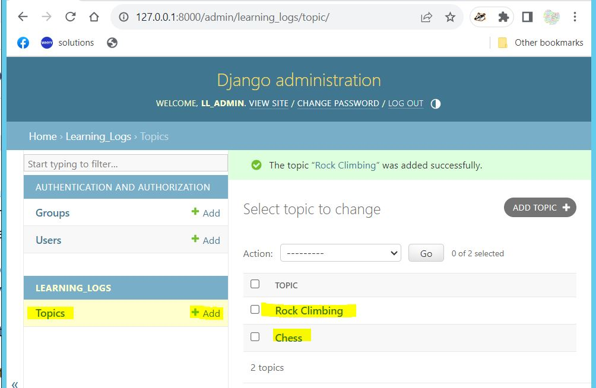
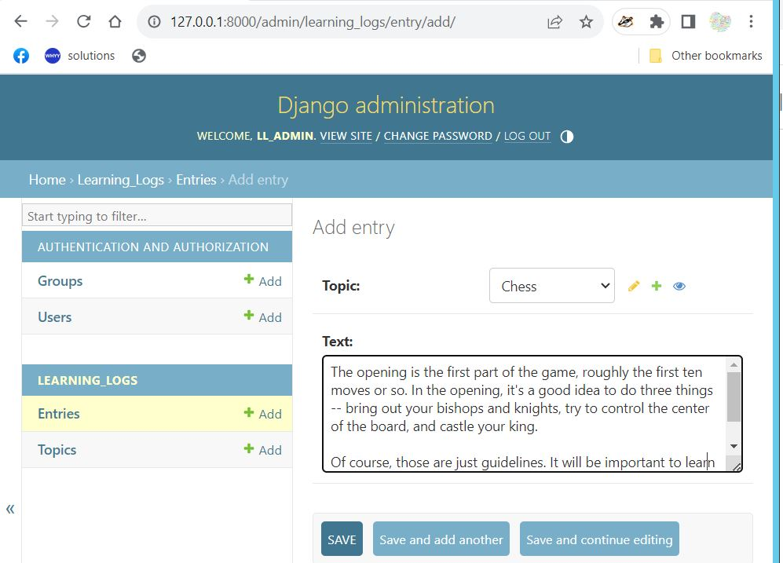

# Chapter 18: Getting Started with Django

## Specification

We'll write a web app called Learning Log that allows users to log the topics they're
interested in and to make journal entries as they learn about each topic. The Learning Log
home page will describe the site and invite users to either register or login. Once
logged in, a user can create new topics, add new entries, and read and
edit existing entries.

## Creating a Virtual Environment

python -m venv .venv

source .venv/Scripts/activate

To stop using a virtual environment, enter **deactivate**.

deactivate

## Installing Django

pip install django

## Creating a Project in Django

django-admin startproject learning_log .

ls learning_log

\_\_init\_\_.py asgi.py settings.py urls.py wsgi.py

## Creating the Database

python manage.py migrate

Running the ls command shows that Django created another file called db.sqlite3.

## Viewing the Project

python manage.py runserver

## Starting an App

A Django project is organized as a group of individual apps that work toether to make
the project work as a whole.

Leave the development server running and open a new terminal window.

source .venv/Scripts/activate

python manage.py startapp learning_logs

## Defining Models

Open the file models.py.

```
from django.db import models

# Create your models here.
```

A module called models is being imported and we can create our models here.

```
from django.db import models

class Topic(models.Model):
    """A topic the user is learning about."""
    text = models.CharField(max_length=200)
    date_added = models.DateTimeField(auto_now_add=True)

    def __str__(self):
        """Return a string representation of the model."""
        return self.text
```

## Activating Models

Open _settings.py_ in the learning*log/learning_log directory. Modify \_settings.py* as follows:

```
INSTALLED_APPS = [
    # My apps
    'learning_logs',

    # Default Django apps.
```

Tell Django to modify the database so it can store information about the topic.

python manage.py makemigrations learning_logs

Apply the migration (learning_logs/migrations/001_initial.py) using the following command:

python manage.py migrate

## The Django Admin Site

### Setting Up a Superuser

To create a superuser in Django, enter the following command and enter the required information:

```
$ python manage.py createsuperuser
Username (leave blank to use 'drste'): ll_admin
Email address:
Password:
Password (again):
This password is too short. It must contain at least 8 characters.
This password is too common.
Bypass password validation and create user anyway? [y/N]: y
Superuser created successfully.
(.venv)
```

### Registering a Model with the Admin Site

Open admin.py in the learning_logs folder.

### Adding Topics



### Defining an Entry Model

Here's the code for the Entry model. Put the code in your models.py file.

```
class Entry(models.Model):
    """Something specific learned about a topc."""
    topic = models.ForeignKey(Topic, on_delete = models.CASCADE)
    text = models.TextField()
    date_added = models.DateTimeField(auto_now_add=True)

    class Meta:
        verbose_name_plural = 'entries'

    def __str__(self):
        """Return a string representation of the model."""
        return f"{self.text[:50]}..."
```

### Migrating the Entry Model

```
$ python manage.py makemigrations learning_logs
Migrations for 'learning_logs':
  learning_logs\migrations\0002_entry.py
    - Create model Entry
```

```
$ python manage.py migrate
Operations to perform:
  Apply all migrations: admin, auth, contenttypes, learning_logs, sessions
Running migrations:
  Applying learning_logs.0002_entry... OK
```

### Registering Entry with the Admin Site

Modify the admin.py file as follows:

```
from django.contrib import admin
from learning_logs.models import Topic, Entry

admin.site.register(Topic)
admin.site.register(Entry)
```



### The Django Shell

```
$ python manage.py shell
Python 3.11.4 (tags/v3.11.4:d2340ef, Jun  7 2023, 05:45:37) [MSC v.1934 64 bit (AMD64)] on win32
Type "help", "copyright", "credits" or "license" for more information.
(InteractiveConsole)
>>> from learning_logs.models import Topic
>>> Topic.objects.all()
<QuerySet [<Topic: Chess>, <Topic: Rock Climbing>]>
>>> topics = Topic.objects.all()
>>> for topic in topics:
...     print(topic.id, topic)
...
1 Chess
2 Rock Climbing
>>> t = Topic.objects.get(id=1)
>>> t.text
'Chess'
>>> t.date_added
datetime.datetime(2023, 7, 31, 15, 44, 29, 839993, tzinfo=datetime.timezone.utc)
>>> t.entry_set.all()
<QuerySet [<Entry: The opening is the first part of the game, roughly...>]>
```

## Making Pages: The Learning Log Home Page

Making web pages with Django consists of three stages:

1. defining URLs
1. Writing views
1. Writing templates

You can do these in any order, but starting with defining the ULR pattern may be best.

### Mapping a URL

The contents of the urls.py file, after the learning_logs line is added:

```
from django.contrib import admin
from django.urls import include, path

urlpatterns = [
    path('admin/', admin.site.urls),
    path('', include('learning_logs.urls'))
]
```

### Writing a View
